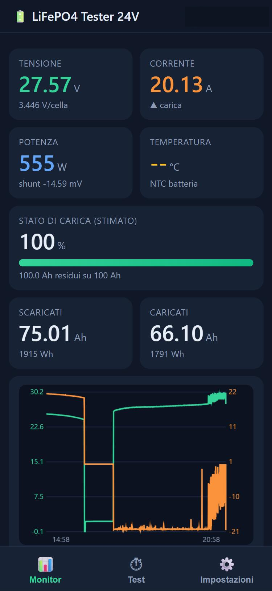
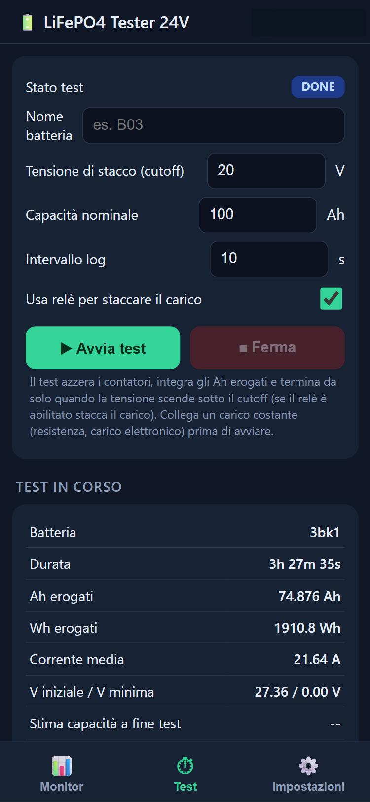
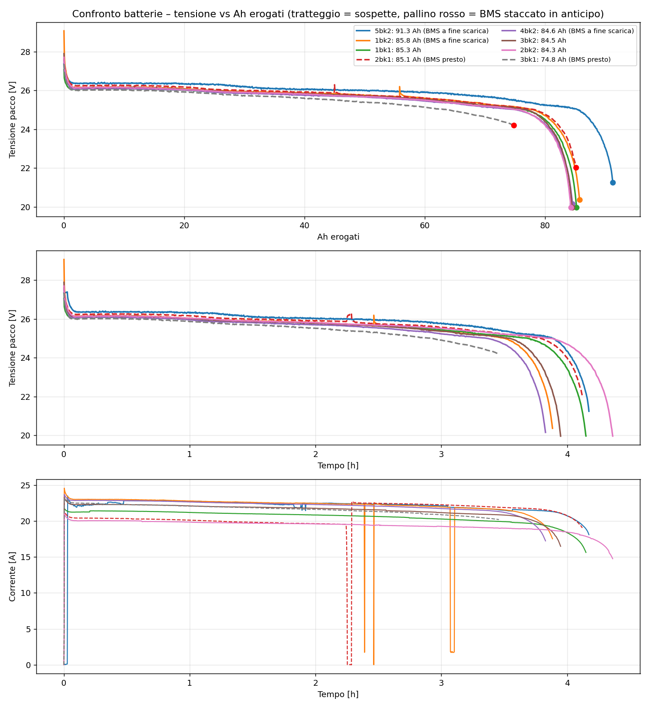

# ESP32 LiFePO4 Battery Tester

**Tester di capacità e logger diagnostico per batterie LiFePO4 da 24 V (8S), nato per trovare la cella che fa staccare il BMS in anticipo.**

Firmware ESP32 (C++), catena di misura a 16 bit (shunt + ADS1115), conteggio di carica con correzione SOC da tensione a vuoto, stima della resistenza interna, rilevamento dello stacco del BMS e una web-app per telefono o PC servita dalla scheda stessa. Nessun cloud, nessuna libreria esterna.

> 🇬🇧 [English version](README.md) · [Guida completa all'uso](docs/USER_GUIDE.it.md) · [Hardware e cablaggio](docs/HARDWARE.it.md)

  
  

## Risultati

Otto batterie 24 V / 100 Ah dello stesso lotto, scaricate a circa 20 A (media 19,3-22,1 A) fino al cutoff di 20,0 V o allo stacco del BMS.

| Pos. | Batteria | Ah erogati | Fine | V finale | Giudizio |
|---|---|---|---|---|---|
| 1 | 5bk2 | 91,3 | BMS | 21,1 V | buona |
| 2 | 1bk2 | 85,8 | - | - | buona |
| 3 | 1bk1 | 85,3 | cutoff | 20,0 V | buona |
| 4 | 2bk1 | 85,2 (45,0 + 40,2) | BMS | 22,0 V | buona (test spezzato da un morsetto) |
| 5 | 4bk2 | 84,6 | cutoff | 20,0 V | buona |
| 6 | 3bk2 | 84,5 | cutoff | 20,0 V | buona |
| 7 | 2bk2 | 84,3 | cutoff | 20,0 V | buona |
| 8 | **3bk1** | **74,9** | **BMS** | **24,2 V** | **difettosa** |

**3bk1:** la curva sta sotto le altre fin da circa 30 Ah e il divario cresce; il BMS stacca a 24,2 V, cioè una cella a 2,5 V mentre le altre sette sono ancora vicino a 3,1 V. In carica il BMS comincia a spezzare già a 27,6-28,1 V e il pacco riprende solo circa l'88 % degli Ah scaricati, contro il 94-95 % delle sane. Entrambi gli estremi indicano una cella con capacità ridotta, non un semplice sbilanciamento.

La stima di resistenza interna da gradino di carico (2-45 mΩ tra un test e l'altro) non è abbastanza affidabile per fare classifiche: il contatto del carico pesa più della batteria. Contano la capacità e la tensione di fine scarica.

## Come funziona

Shunt 100 A / 75 mV letto da un ADS1115 (PGA ±256 mV, circa 10 mA per bit), partitore 13:1 per la tensione, ESP32 con LittleFS per CSV e storico, test che riparte da solo dopo un riavvio, allarmi, taratura dall'app, aggiornamento firmware via Wi-Fi. Dettagli di progetto in inglese nel [README principale](README.md); uso, taratura e API nella [guida](docs/USER_GUIDE.it.md).

## Limiti

Nessuna autenticazione: tenere il tester su una rete fidata, mai esposto con un port forward. Precisione limitata dai riferimenti di taratura (multimetro, pinza amperometrica) e dallo shunt: è uno strumento di confronto tra pacchi provati nelle stesse condizioni, non di metrologia. Parti del firmware sono state scritte con assistenza AI; progetto del circuito, metodo di prova, validazione al banco e taratura sono miei.

## Sicurezza

Un pacco LiFePO4 da 100 Ah può erogare migliaia di ampere in corto circuito: fusibile su B+ vicino alla batteria, cavi dimensionati e leggere [docs/HARDWARE.it.md](docs/HARDWARE.it.md) prima di cablare. Progetto amatoriale, senza alcuna garanzia.
